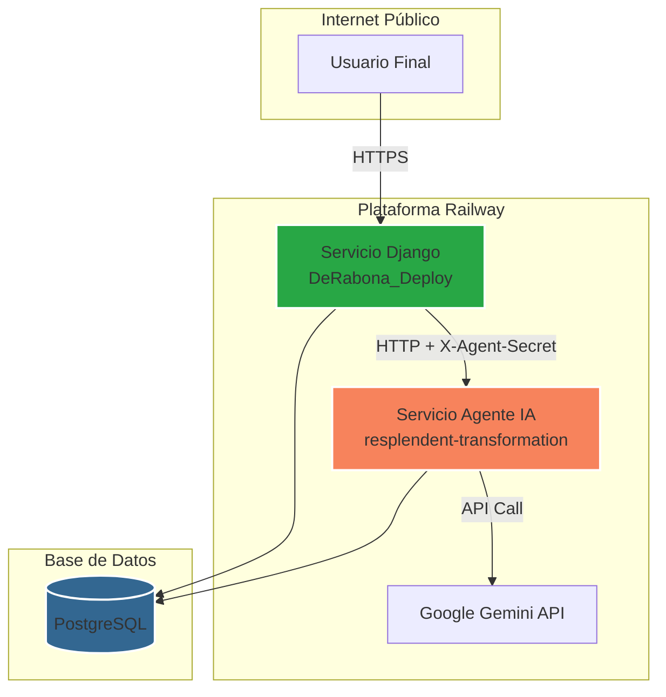
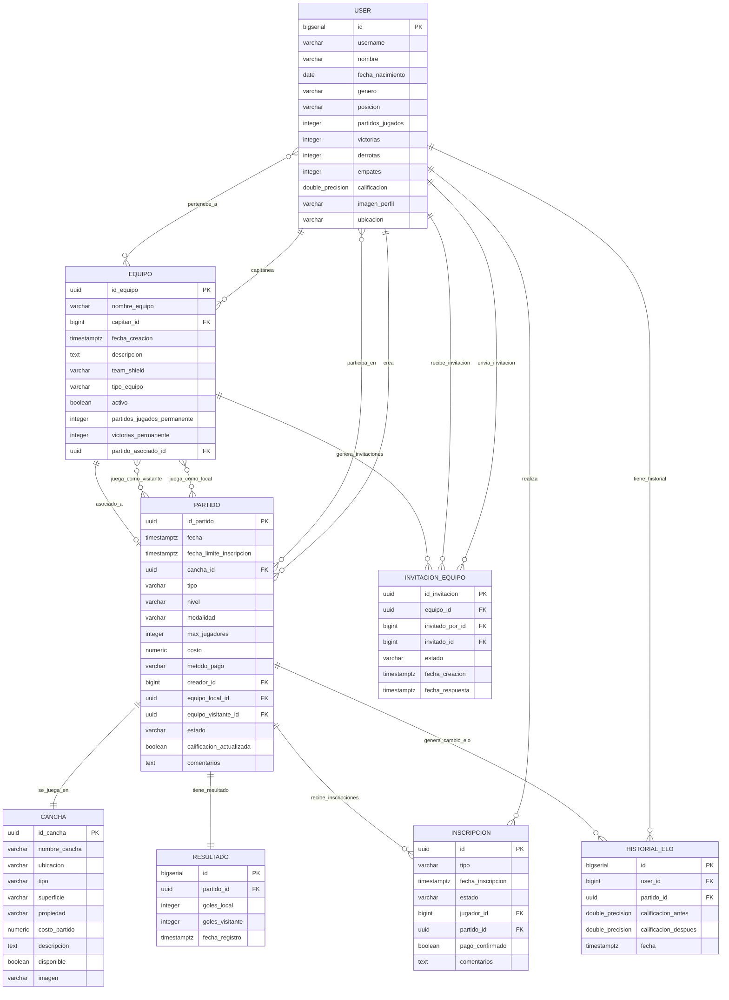
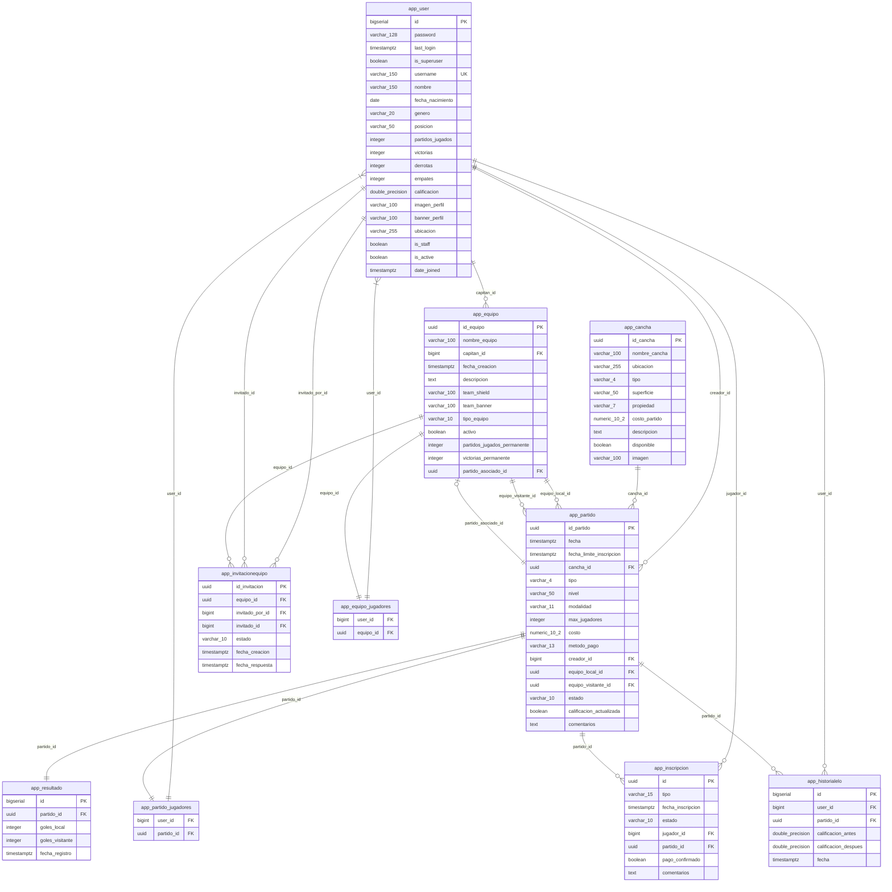
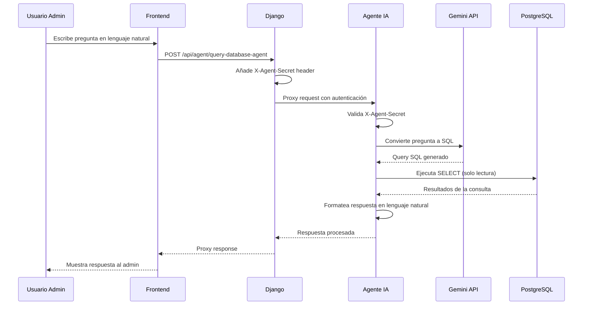

# De Rabona: Conecta, Juega, Gana


**De Rabona** es una plataforma web completa diseñada para conectar a aficionados del fútbol. Permite a los usuarios organizar partidos, crear y gestionar equipos, encontrar canchas y competir para mejorar su ranking personal a través de un sistema de calificación ELO.

El proyecto destaca por su arquitectura de microservicios, que incluye un backend principal con **Django** y un servicio de agente de IA independiente construido con **FastAPI**. Este agente permite a los administradores realizar consultas complejas a la base de datos utilizando lenguaje natural, demostrando una integración avanzada de IA en una aplicación web funcional.

---

## 🏗️ Arquitectura del Sistema



## ✨ Características Principales

- **🏆 Sistema de Ranking ELO**: Calificación automática que refleja el nivel de habilidad de cada jugador
- **⚽ Gestión de Partidos**: Organización de "Partidos Abiertos" y "Retos de Equipo"
- **👥 Equipos y Clubes**: Creación y gestión de equipos permanentes con sistema de invitaciones
- **🏟️ Catálogo de Canchas**: Registro y descubrimiento de canchas de fútbol
- **📊 Estadísticas Avanzadas**: Seguimiento detallado de rendimiento individual y por equipo
- **🤖 Asistente IA**: Consultas en lenguaje natural para análisis de datos administrativos
- **🔐 Autenticación Segura**: Sistema completo de registro, login y gestión de perfiles


######


# Base de Datos De Rabona

## 📊 Diagrama Entidad-Relación (E/R)



## 🗄️ Modelo Relacional PostgreSQL



## 📋 Descripción de Entidades

### **Entidades Principales**

#### **USER (app_user)**
- **Propósito**: Gestión de usuarios y jugadores del sistema
- **Clave Primaria**: `id` (BIGSERIAL)
- **Características**: 
  - Sistema de autenticación completo (hereda de Django User)
  - Ranking ELO personalizado
  - Estadísticas de partidos (victorias, derrotas, empates)
  - Perfil personalizable con imágenes

#### **EQUIPO (app_equipo)**
- **Propósito**: Gestión de equipos permanentes y temporales
- **Clave Primaria**: `id_equipo` (UUID)
- **Tipos**: 
  - **PERMANENTE**: Clubes estables con plantilla fija
  - **PARTIDO**: Equipos temporales para partidos específicos
- **Sistema de capitanía**: Un usuario lidera cada equipo

#### **PARTIDO (app_partido)**
- **Propósito**: Entidad central para encuentros de fútbol
- **Clave Primaria**: `id_partido` (UUID)
- **Estados**: PROGRAMADO, EN_CURSO, FINALIZADO, CANCELADO
- **Modalidades**: AMISTOSO (sin ELO), COMPETITIVO (con ELO)

#### **CANCHA (app_cancha)**
- **Propósito**: Instalaciones deportivas
- **Clave Primaria**: `id_cancha` (UUID)
- **Tipos**: SALA, F7, F11
- **Gestión**: Pública/Privada con costos asociados

### **Entidades de Soporte**

#### **INVITACION_EQUIPO (app_invitacionequipo)**
- **Propósito**: Sistema de invitaciones para unirse a equipos
- **Clave Primaria**: `id_invitacion` (UUID)
- **Estados**: PENDIENTE, ACEPTADA, RECHAZADA
- **Restricción**: Solo una invitación pendiente por usuario-equipo

#### **INSCRIPCION (app_inscripcion)**
- **Propósito**: Solicitudes para participar en partidos
- **Gestión de pagos**: Confirmación de pago integrada
- **Estados**: PENDIENTE, ACEPTADA, RECHAZADA

#### **RESULTADO (app_resultado)**
- **Propósito**: Marcadores finales de partidos
- **Relación 1:1**: Un partido tiene un único resultado
- **Datos**: Goles local/visitante, fecha de registro

#### **HISTORIAL_ELO (app_historialelo)**
- **Propósito**: Auditoría de cambios en el ranking
- **Rastrea**: ELO antes/después de cada partido competitivo
- **Permite**: Análisis de progresión de jugadores

### **Relaciones Muchos a Muchos**

#### **app_equipo_jugadores**
- **Relación**: Usuario ↔ Equipo
- **Permite**: Jugadores en múltiples equipos

#### **app_partido_jugadores**
- **Relación**: Usuario ↔ Partido  
- **Gestiona**: Participación individual en partidos

## 🔧 Características Técnicas

### **Tipos de Claves**
- **BIGSERIAL**: Para compatibilidad con Django User
- **UUID**: Para entidades principales (seguridad y escalabilidad)
- **Claves foráneas**: Integridad referencial completa

### **Restricciones Especiales**
- **Invitaciones únicas**: Un usuario solo puede tener una invitación pendiente por equipo
- **CHECK constraints**: Validación de estados y tipos enumerados
- **Integridad temporal**: Fechas de respuesta opcionales con validación

### **Optimizaciones**
- **Índices UUID**: Búsquedas eficientes en entidades principales
- **Índices compuestos**: Para consultas frecuentes usuario-equipo
- **Eliminación en cascada**: Limpieza automática de datos huérfanos


######


## 🛠️ Stack Tecnológico

### Backend
- **Django 5.1.3**: Framework web principal
- **FastAPI 0.115.12**: Microservicio de IA
- **PostgreSQL (Supabase)**: Base de datos principal
- **Google Gemini (via LiteLLM)**: Modelo de IA para procesamiento de lenguaje natural

### Frontend
- **HTML5/CSS3**: Estructura y estilos
- **JavaScript**: Interactividad del cliente
- **Bootstrap 5**: Framework CSS para diseño responsivo
- **Three.js**: Renderizado 3D para el asistente virtual
- **jQuery 3.6.0**: Manipulación DOM y AJAX

### Infraestructura
- **Railway**: Plataforma de despliegue para aplicaciones
- **Supabase**: Hosting de base de datos PostgreSQL
- **Docker**: Containerización para desarrollo local
- **Gunicorn**: Servidor WSGI para Django
- **Uvicorn**: Servidor ASGI para FastAPI
- **Nginx**: Proxy inverso para desarrollo local

### Dependencias Principales

**Django (TFG/):**
```txt
Django==5.1.3
django-crispy-forms==2.3
crispy-bootstrap5==2024.10
psycopg2-binary==2.9.9
pillow==11.1.0
gunicorn==23.0.0
requests==2.32.3
python-dotenv==1.1.0
whitenoise==6.7.0
dj-database-url==3.0.0
```

**FastAPI Agent (agent_database_tfg/):**
```txt
fastapi==0.115.12
uvicorn==0.34.3
litellm==1.72.1
SQLAlchemy==2.0.41
psycopg2-binary==2.9.9
pydantic==2.11.5
openai==1.84.0
python-dotenv==1.1.0
gunicorn==23.0.0
```

## 📋 Requisitos Previos

- **Python 3.12+**
- **Docker** y **Docker Compose**
- **PostgreSQL** (local o servicio en la nube)
- **API Key de Google Gemini**

## 🚀 Instalación y Despliegue

### 📖 Desarrollo Local (Para Pruebas)

#### 1. Clonar el Repositorio

```bash
git clone https://github.com/JosCarRub/de-rabona.git
cd de-rabona
```

#### 2. Configurar Variables de Entorno (Desarrollo)

**Para Django (`TFG/.env`):**

```env
# Configuración de desarrollo
DEBUG=True
DJANGO_SECRET_KEY='xxxxxxxxxxxx'

# Base de datos Supabase (misma para desarrollo y producción)
DATABASE_URL='XXXXXXXXXXXX'

# URL del agente en Docker Compose
AI_AGENT_INTERNAL_URL='http://fastapi_agent:8001/query-database-agent'

# Clave secreta para comunicación con el agente
AGENT_SECRET_KEY='xxxxxxxxxx!'

# Configuración de archivos estáticos para desarrollo
STATIC_ROOT='/app/staticfiles'
MEDIA_ROOT='/app/media'
```

**Para el Agente IA (`agent_database_tfg/.env`):**

```env
# Misma base de datos Supabase que Django
DATABASE_URL='XXXXXXXXXXXX'

# API Key de Google Gemini
LITELLM_API_KEY='tu_api_key_de_gemini'

# Misma clave secreta para autenticación
AGENT_SECRET_KEY='xxxxxxxxxx'
```

#### 3. Levantar Entorno de Desarrollo

```bash
# Construir y ejecutar todos los servicios (Django + FastAPI + Nginx)
docker-compose up --build -d

# Aplicar migraciones
docker-compose exec django_app python manage.py migrate

# Crear datos de prueba (opcional)
docker-compose exec django_app python manage.py loaddata fixtures/dev_data.json

# Crear superusuario para desarrollo
docker-compose exec django_app python manage.py createsuperuser
```

#### 4. Acceso en Desarrollo

- **Aplicación principal**: [http://localhost:80](http://localhost:80)
- **Panel de administración**: [http://localhost:80/admin](http://localhost:80/admin)
- **Logs en tiempo real**: `docker-compose logs -f`

### 🌐 Producción (Railway)

#### 1. Configuración de Variables en Railway

**Servicio Django:**
```env
DEBUG=False
DJANGO_SECRET_KEY='xxxxxxxxx'
DATABASE_URL='XXXXXXXXXXXX'
AI_AGENT_INTERNAL_URL='https://xxxxxxx/query-database-agent'
AGENT_SECRET_KEY='xxxxxxxxxx'
ALLOWED_HOSTS='xxxxxxx.app'
```

**Servicio Agente IA:**
```env
DATABASE_URL='XXXXXXXXXXXX'
LITELLM_API_KEY='production_gemini_api_key'
AGENT_SECRET_KEY='xxxxxxx'
```

#### 2. Configuración de Base de Datos en Producción

La base de datos PostgreSQL está alojada en **Supabase**, no en Railway. Las migraciones se ejecutan desde Railway pero apuntan a la instancia de Supabase:

```bash
# Ejecutar migraciones en Railway 
railway run python manage.py migrate

# Crear superusuario en producción
railway run python manage.py createsuperuser
```


## 🎨 Diseño de la Interfaz

### Responsive Web Design (RWD)

La aplicación está diseñada siguiendo los principios del diseño web adaptativo para garantizar una experiencia óptima en todos los dispositivos:

**Breakpoints Principales:**
- **Mobile First**: `min-width: 320px` - Smartphones
- **Tablet**: `min-width: 768px` - Tablets y pantallas medianas
- **Desktop**: `min-width: 1024px` - Ordenadores de escritorio
- **Large Desktop**: `min-width: 1200px` - Pantallas grandes

### Framework de Maquetación

**Bootstrap 5.3.0:**
- **Grid System**: Sistema de 12 columnas para layouts responsivos
- **Flexbox**: Utilización extensiva para alineación y distribución
- **Utility Classes**: Clases de utilidad para espaciado, colores y tipografía
- **Components**: Modales, cards, navegación y formularios personalizados


## 🏗️ Arquitectura del Cliente

### Tecnologías JavaScript


**AJAX y Fetch API:**
- **Inscripciones**: Unirse/abandonar partidos sin recarga de página
- **Búsqueda en tiempo real**: Filtrado de canchas y jugadores
- **Actualizaciones de estado**: Cambios de estado de partido en vivo

### Funcionalidades Avanzadas

**Drag & Drop para Formación de Equipos:**
```javascript
function initializeDragAndDrop(options) {
    let draggedElement = null;
    const dragPreview = document.getElementById('dragPreview');
    const touchFeedback = document.getElementById('touchFeedback');

    const draggablePlayers = document.querySelectorAll('.field-player, .bench-player');
    const dropZones = document.querySelectorAll('.team-zone, .bench-players');

    function setupDraggablePlayer(player) {
        player.addEventListener('dragstart', handleDragStart);
        player.addEventListener('dragend', handleDragEnd);
        player.addEventListener('touchstart', handleTouchStart, { passive: false });
        player.addEventListener('touchmove', handleTouchMove, { passive: false });
        player.addEventListener('touchend', handleTouchEnd);
        player.setAttribute('tabindex', '0');
    }

    function setupDropZone(zone) {
        zone.addEventListener('dragover', handleDragOver);
        zone.addEventListener('drop', handleDrop);
        zone.addEventListener('dragenter', handleDragEnter);
        zone.addEventListener('dragleave', handleDragLeave);
    }

    function handleDragStart(e) {
        draggedElement = this;
        this.classList.add('dragging');
        e.dataTransfer.effectAllowed = 'move';
        e.dataTransfer.setData('text/plain', this.dataset.jugadorId);
        createDragPreview(this, e);
    }

    function handleDragEnd() {
        this.classList.remove('dragging');
        draggedElement = null;
        if (dragPreview) dragPreview.style.display = 'none';
        dropZones.forEach(zone => zone.classList.remove('drag-over'));
        if (options.onDrop) options.onDrop();
    }

    function handleDragOver(e) {
        e.preventDefault();
        e.dataTransfer.dropEffect = 'move';
    }

    function handleDragEnter(e) {
        e.preventDefault();
        this.classList.add('drag-over');
    }

    function handleDragLeave(e) {
        if (!this.contains(e.relatedTarget)) {
            this.classList.remove('drag-over');
        }
    }

    function handleDrop(e) {
        e.preventDefault();
        this.classList.remove('drag-over');
        if (!draggedElement) return;
        movePlayerToZone(draggedElement, this);
    }

    let touchStartPos = { x: 0, y: 0 };
    let isDraggingTouch = false;

    function handleTouchStart(e) {
        if (options.getCurrentMode() !== 'drag') return;
        const touch = e.touches[0];
        touchStartPos = { x: touch.clientX, y: touch.clientY };
        draggedElement = this;
        showTouchFeedback(touch.clientX, touch.clientY);
    }

    function handleTouchMove(e) {
        if (!draggedElement || options.getCurrentMode() !== 'drag') return;
        const touch = e.touches[0];
        const distance = Math.hypot(touch.clientX - touchStartPos.x, touch.clientY - touchStartPos.y);

        if (distance > 10 && !isDraggingTouch) {
            isDraggingTouch = true;
            draggedElement.classList.add('dragging');
            createDragPreview(draggedElement);
            document.body.style.overflow = 'hidden';
        }

        if (isDraggingTouch) {
            e.preventDefault();
            updateDragPreview(touch.clientX, touch.clientY);
            const elementBelow = document.elementFromPoint(touch.clientX, touch.clientY);
            const dropZone = elementBelow?.closest('.team-zone, .bench-players');
            dropZones.forEach(zone => zone.classList.toggle('drag-over', zone === dropZone));
        }
    }

    function handleTouchEnd(e) {
        if (!isDraggingTouch || !draggedElement) {
            resetTouchState();
            return;
        }
        
        const touch = e.changedTouches[0];
        const elementBelow = document.elementFromPoint(touch.clientX, touch.clientY);
        const dropZone = elementBelow?.closest('.team-zone, .bench-players');

        if (dropZone) {
            movePlayerToZone(draggedElement, dropZone);
        }
        resetTouchState();
    }

    function resetTouchState() {
        if (draggedElement) draggedElement.classList.remove('dragging');
        dropZones.forEach(zone => zone.classList.remove('drag-over'));
        if (dragPreview) dragPreview.style.display = 'none';
        if (touchFeedback) touchFeedback.classList.remove('active');
        document.body.style.overflow = '';
        draggedElement = null;
        isDraggingTouch = false;
    }

    function createDragPreview(element, event) {
        if (!dragPreview) return;
        const isBenchPlayer = element.classList.contains('bench-player');
        if (isBenchPlayer) {
            dragPreview.innerHTML = `<div class="bench-player">${element.innerHTML}</div>`;
        } else {
            dragPreview.innerHTML = `<div class="field-player ${element.className.replace('dragging', '')}">${element.innerHTML}</div>`;
        }
        dragPreview.style.display = 'block';
        if (event) {
            event.dataTransfer.setDragImage(dragPreview, 30, 30);
        }
    }

    function updateDragPreview(x, y) {
        if (!dragPreview) return;
        dragPreview.style.left = `${x - 30}px`;
        dragPreview.style.top = `${y - 30}px`;
    }

    function showTouchFeedback(x, y) {
        if (!touchFeedback) return;
        touchFeedback.style.left = `${x - 40}px`;
        touchFeedback.style.top = `${y - 40}px`;
        touchFeedback.classList.add('active');
        setTimeout(() => touchFeedback.classList.remove('active'), 200);
    }

    function movePlayerToZone(playerElement, targetZone) {
        const targetTeam = getTeamFromZone(targetZone);
        let targetContainer;

        if (targetTeam === 'local') {
            targetContainer = document.getElementById('local-players');
            playerElement.className = 'field-player local-player';
        } else if (targetTeam === 'visitante') {
            targetContainer = document.getElementById('visitante-players');
            playerElement.className = 'field-player visitante-player';
        } else {
            targetContainer = document.getElementById('bench-players');
            playerElement.className = 'bench-player';
        }
        targetContainer.appendChild(playerElement);
    }

    function getTeamFromZone(zone) {
        if (zone.dataset.team) return zone.dataset.team;
        if (zone.id === 'local-players' || zone.closest('.local-zone')) return 'local';
        if (zone.id === 'visitante-players' || zone.closest('.visitante-zone')) return 'visitante';
        return 'bench';
    }

    draggablePlayers.forEach(setupDraggablePlayer);
    dropZones.forEach(setupDropZone);
}
```

**Three.js para Modelo 3D:**
```javascript
// Inicializar WebGL para la cara
function initializeFaceGL() {
    gl = faceCanvas.getContext('webgl');
    if (!gl) {
        console.error('WebGL no disponible');
        return;
    }
    
    const vertexShader = createShader(gl, gl.VERTEX_SHADER, document.getElementById('faceVertexShader').textContent);
    const fragmentShader = createShader(gl, gl.FRAGMENT_SHADER, document.getElementById('faceFragmentShader').textContent);
    
    program = createProgram(gl, vertexShader, fragmentShader);
    
    // Buffer de vértices
    const buffer = gl.createBuffer();
    gl.bindBuffer(gl.ARRAY_BUFFER, buffer);
    gl.bufferData(gl.ARRAY_BUFFER, new Float32Array([-1, 1, -1, -1, 1, -1, 1, 1]), gl.STATIC_DRAW);
    
    const vPosition = gl.getAttribLocation(program, 'vPosition');
    gl.vertexAttribPointer(vPosition, 2, gl.FLOAT, false, 0, 0);
    gl.enableVertexAttribArray(vPosition);
    
    gl.useProgram(program);
    gl.viewport(0, 0, faceCanvas.width, faceCanvas.height);
    
    // Uniforms
    gl.uniform2fv(gl.getUniformLocation(program, 'resolution'), [faceCanvas.width, faceCanvas.height]);
}

// Inicializar WebGL para el fondo
function initializeBackgroundGL() {
    backgroundGL = backgroundCanvas.getContext('webgl');
    if (!backgroundGL) return;
    
    const bgVertexShader = `
        attribute vec4 vPosition;
        void main() {
            gl_Position = vPosition;
        }
    `;
    
    const bgFragmentShader = `
        #ifdef GL_ES
        precision mediump float;
        #endif
        uniform float time;
        uniform vec2 resolution;
        
        void main() {
            vec2 uv = gl_FragCoord.xy / resolution.xy;
            vec3 color = vec3(0.05, 0.1, 0.2);
            
            // Partículas flotantes
            for(int i = 0; i < 3; i++) {
                float fi = float(i);
                vec2 p = uv + vec2(sin(time * 0.5 + fi), cos(time * 0.3 + fi)) * 0.1;
                float d = length(p - 0.5);
                color += vec3(0.02, 0.05, 0.1) / (d * 10.0);
            }
            
            gl_FragColor = vec4(color, 1.0);
        }
    `;
    
    const vertexShader = createShader(backgroundGL, backgroundGL.VERTEX_SHADER, bgVertexShader);
    const fragmentShader = createShader(backgroundGL, backgroundGL.FRAGMENT_SHADER, bgFragmentShader);
    
    backgroundProgram = createProgram(backgroundGL, vertexShader, fragmentShader);
    
    const buffer = backgroundGL.createBuffer();
    backgroundGL.bindBuffer(backgroundGL.ARRAY_BUFFER, buffer);
    backgroundGL.bufferData(backgroundGL.ARRAY_BUFFER, new Float32Array([-1, 1, -1, -1, 1, -1, 1, 1]), backgroundGL.STATIC_DRAW);
    
    const vPosition = backgroundGL.getAttribLocation(backgroundProgram, 'vPosition');
    backgroundGL.vertexAttribPointer(vPosition, 2, backgroundGL.FLOAT, false, 0, 0);
    backgroundGL.enableVertexAttribArray(vPosition);
    
    backgroundGL.useProgram(backgroundProgram);
    backgroundGL.viewport(0, 0, backgroundCanvas.width, backgroundCanvas.height);
    
    backgroundGL.uniform2fv(backgroundGL.getUniformLocation(backgroundProgram, 'resolution'), [backgroundCanvas.width, backgroundCanvas.height]);
}

// Crear shader
function createShader(gl, type, source) {
    const shader = gl.createShader(type);
    gl.shaderSource(shader, source);
    gl.compileShader(shader);
    
    if (!gl.getShaderParameter(shader, gl.COMPILE_STATUS)) {
        console.error('Error compilando shader:', gl.getShaderInfoLog(shader));
        gl.deleteShader(shader);
        return null;
    }
    
    return shader;
}

// Crear programa WebGL
function createProgram(gl, vertexShader, fragmentShader) {
    const program = gl.createProgram();
    gl.attachShader(program, vertexShader);
    gl.attachShader(program, fragmentShader);
    gl.linkProgram(program);
    
    if (!gl.getProgramParameter(program, gl.LINK_STATUS)) {
        console.error('Error enlazando programa:', gl.getProgramInfoLog(program));
        gl.deleteProgram(program);
        return null;
    }
    
    return program;
}

// Bucle de renderizado
function render() {
    const time = (Date.now() - startTime) / 1000;
    
    // Renderizar fondo
    if (backgroundGL && backgroundProgram) {
        backgroundGL.useProgram(backgroundProgram);
        backgroundGL.uniform1f(backgroundGL.getUniformLocation(backgroundProgram, 'time'), time);
        backgroundGL.drawArrays(backgroundGL.TRIANGLE_FAN, 0, 4);
    }
    
    // Renderizar cara
    if (gl && program) {
        gl.useProgram(program);
        gl.uniform1f(gl.getUniformLocation(program, 'time'), time);
        gl.uniform2fv(gl.getUniformLocation(program, 'mouse'), [mouseX, mouseY]);
        gl.uniform1f(gl.getUniformLocation(program, 'speaking'), speakingLevel);
        gl.uniform1f(gl.getUniformLocation(program, 'energy'), energyLevel);
        
        // Animar niveles
        if (isSpeaking) {
            speakingLevel = Math.min(speakingLevel + 0.1, 1.0);
            energyLevel = 0.5 + Math.sin(time * 10) * 0.3;
        } else {
            speakingLevel = Math.max(speakingLevel - 0.05, 0.0);
            energyLevel = Math.max(energyLevel - 0.02, 0.0);
        }
        
        gl.drawArrays(gl.TRIANGLE_FAN, 0, 4);
    }
    
    requestAnimationFrame(render);
}
```


## 🔧 Arquitectura del Servidor


### Estructura del Código

**Patrón MVT (Model-View-Template):**
```
TFG/
└── app/
    ├── forms/
    │   ├── __init__.py
    │   ├── canchas_forms.py      # Formularios para Canchas
    │   ├── equipo_forms.py       # Formularios para Equipos
    │   ├── partido_forms.py      # Formularios para Partidos
    │   └── user_forms.py         # Formularios de registro y perfil de usuario
    ├── models/
    │   ├── __init__.py
    │   ├── cancha.py             # Modelo Cancha
    │   ├── equipo.py             # Modelo Equipo
    │   ├── historial.py          # Modelo HistorialELO
    │   ├── inscripcion.py        # Modelo Inscripcion
    │   ├── invitacion.py         # Modelo InvitacionEquipo
    │   ├── partido.py            # Modelo Partido
    │   ├── resultado.py          # Modelo Resultado
    │   └── user.py               # Modelo User 
    ├── static/
    │   ├── css/
    │   │   └── ... (Archivos CSS organizados por sección)
    │   └── js/
    │       └── ... (Archivos JS organizados por sección)
    ├── templates/
    │   ├── auth/
    │   ├── canchas/
    │   ├── partidos/
    │   ├── equipos/
    │   ├── perfil/
    │   ├── registration/
    │   ├── estadisticas/
    │   ├── global/
    │   └── base.html
    ├── templatetags/
    │   ├── __init__.py
    │   └── attribute_filters.py  # Filtros personalizados para plantillas
    ├── views/
    │   ├── __init__.py
    │   ├── canchas_views.py      # Vistas relacionadas con Canchas
    │   ├── commons_views.py      # Vistas comunes (Home, Landing, etc.)
    │   ├── equipo_views.py       # Vistas para Equipos
    │   ├── estadisticas_views.py # Vistas para Estadísticas
    │   ├── mis_partidos_views.py # Vistas para la sección "Mis Partidos"
    │   ├── partido_views.py      # Vistas para Partidos
    │   ├── proxy.py              # Vista del Proxy al agente IA
    │   └── user_views.py         # Vistas de autenticación y perfiles
    ├── admin.py                  # Configuración del Admin de Django
    ├── context_processors.py     # Procesadores de contexto para plantillas
    └── urls.py                   # URLs específicas de la app
    
```

### Librerías del Servidor

**Backend Principal (Django):**
- **Django 5.1**: Framework web principal
- **Django REST Framework**: API endpoints
- **Pillow**: Procesamiento de imágenes de perfil
- **python-decouple**: Gestión de variables de entorno
- **psycopg2-binary**: Conector PostgreSQL
- **gunicorn**: Servidor WSGI para producción
- **whitenoise**: Servicio de archivos estáticos

**Microservicio IA (FastAPI):**
- **FastAPI 0.115**: Framework del agente
- **LiteLLM**: Cliente unificado para LLMs
- **SQLAlchemy**: ORM para consultas a la BD
- **Pydantic**: Validación y serialización de datos
- **uvicorn**: Servidor ASGI de alta performancia


## 🔄 Flujo del Asistente IA

El sistema de consultas inteligentes funciona mediante el siguiente flujo:



**Ejemplos de consultas soportadas:**
- "¿Cuáles son los 5 jugadores con mayor ELO?"
- "¿Qué equipo ha ganado más partidos este mes?"
- "¿Cuántos partidos se han jugado en cada cancha?"

## 🏥 Despliegue en Producción

El proyecto está desplegado en **Railway** con la siguiente configuración:

### Servicios Desplegados
- **Django Service**: `xxxxx`
- **AI Agent Service**: `xxxxx`

### Variables de Entorno en Railway
Las variables se configuran directamente en el dashboard de Railway:

**Django Service:**
- `DJANGO_SECRET_KEY`
- `DATABASE_URL` (PostgreSQL de SupaBase)
- `AI_AGENT_INTERNAL_URL` (URL pública del agente)
- `AGENT_SECRET_KEY`

**AI Agent Service:**
- `DATABASE_URL` (mismo PostgreSQL)
- `LITELLM_API_KEY`
- `AGENT_SECRET_KEY`

## 🧪 Testing

```bash
# Ejecutar tests de Django
docker-compose exec web python manage.py test

# Verificar funcionalidad del agente
curl -X POST http://localhost:8001/query-database-agent \
  -H "Content-Type: application/json" \
  -H "X-Agent-Secret: xxxxxxx" \
  -d '{"question": "¿Cuántos usuarios hay registrados?"}'
```

## 📚 Estructura del Proyecto

```
DeRabona_Deploy/
├── TFG/                          # Directorio raíz de la aplicación Django
│   ├── app/                      # App de Django "app"
│   │   ├── forms/
│   │   │   ├── __init__.py
│   │   │   ├── canchas_forms.py
│   │   │   ├── equipo_forms.py
│   │   │   ├── partido_forms.py
│   │   │   └── user_forms.py
│   │   ├── migrations/
│   │   │   ├── 0001_initial.py
│   │   │   └── __init__.py
│   │   ├── models/
│   │   │   ├── __init__.py
│   │   │   ├── cancha.py
│   │   │   ├── equipo.py
│   │   │   ├── historial.py
│   │   │   ├── inscripcion.py
│   │   │   ├── invitacion.py
│   │   │   ├── partido.py
│   │   │   ├── resultado.py
│   │   │   └── user.py
│   │   ├── static/
│   │   │   ├── css/
│   │   │   │   ├── auth/
│   │   │   │   ├── canchas/
│   │   │   │   ├── equipo/
│   │   │   │   ├── global/
│   │   │   │   ├── partidos/
│   │   │   │   ├── perfil/
│   │   │   │   └── secret/
│   │   │   ├── js/
│   │   │   │   ├── equipo/
│   │   │   │   └── secret/
│   │   │   └── favicon.svg
│   │   ├── templates/
│   │   │   ├── auth/
│   │   │   ├── canchas/
│   │   │   ├── components/
│   │   │   ├── equipos/
│   │   │   ├── estadisticas/
│   │   │   ├── global/
│   │   │   ├── partidos/
│   │   │   ├── perfil/
│   │   │   ├── registration/
│   │   │   ├── secret/
│   │   │   ├── 404.html
│   │   │   ├── base.html
│   │   │   ├── canchas.html
│   │   │   └── main.html
│   │   ├── templatetags/
│   │   │   ├── __init__.py
│   │   │   └── attribute_filters.py
│   │   ├── views/
│   │   │   ├── __init__.py
│   │   │   ├── canchas_views.py
│   │   │   ├── commons_views.py
│   │   │   ├── equipo_views.py
│   │   │   ├── estadisticas_views.py
│   │   │   ├── mis_partidos_views.py
│   │   │   ├── partido_views.py
│   │   │   ├── proxy.py
│   │   │   └── user_views.py
│   │   ├── admin.py
│   │   ├── apps.py
│   │   ├── context_processors.py
│   │   ├── tests.py
│   │   └── urls.py
│   ├── tfg/                      # Directorio de configuración del proyecto Django
│   │   ├── settings/
│   │   │   ├── __init__.py
│   │   │   ├── base.py
│   │   │   ├── local.py
│   │   │   └── production.py
│   │   ├── asgi.py
│   │   ├── old__settings.py
│   │   ├── urls.py
│   │   └── wsgi.py
│   ├── Dockerfile                # Dockerfile para la aplicación Django
│   ├── manage.py
│   └── requirements.txt
├── agent_database_tfg/           # Directorio raíz del microservicio FastAPI
│   ├── config.py
│   ├── Dockerfile                # Dockerfile para el agente FastAPI
│   ├── main.py
│   ├── requirements.txt
│   └── tools.py
├── nginx/                        # Directorio para la configuración de Nginx
│   ├── Dockerfile                # Dockerfile para el servicio Nginx
│   └── nginx.conf                # Archivo de configuración de Nginx
├── docker-compose.yml            # Orquestación de todos los servicios para desarrollo local
└── README.md                     # Documentación del proyecto
```

## 🔑 Credenciales de Prueba

Puedes usar las siguientes credenciales para probar la aplicación, o registrar tus propios usuarios.

**Administrador:**
- **Usuario:** `xxxxxxx@admin.com`
- **Contraseña:** `xxxxxxx`
- **Nota:** Para crear un superusuario en local, ejecuta:
  ```bash
  docker-compose exec django_app python manage.py createsuperuser
  ```

**Jugador de Prueba:**
- **Usuario:** `jugador@derabona.com`
- **Contraseña:** `xxxxxxx`
- **Nota:** Puedes registrar este o cualquier otro usuario a través del formulario de registro de la aplicación.

## ⚠️ Nota sobre Recursos con Licencia

**Modelo 3D:** El proyecto utiliza un modelo 3D para el dashboard interactivo del asistente de IA. Este modelo está sujeto a una licencia que **no permite su redistribución pública**. Por este motivo, el archivo del modelo (`face_mask.glb`) no se incluye en este repositorio. 

El sistema está funcional en producción, pero para ejecutarlo localmente, se deberá sustituir la ruta en `app/templates/secret/dashboard_voice.html` por un modelo 3D alternativo o deshabilitar esta vista.

*Descargo de Responsabilidad*

El autor de este archivo no se hace responsable del uso indebido, malintencionado o no autorizado del mismo. Cualquier persona que acceda, copie, distribuya o manipule este archivo por medios ilícitos o sin el consentimiento expreso del autor, lo hace bajo su exclusiva responsabilidad y en violación de los derechos legales correspondientes. El autor declina toda responsabilidad derivada de acciones realizadas por terceros que obtengan este archivo por vías deshonestas o contrarias a la ley.


## 👨‍💻 Autor

**José Carlos Cataluña Rubio**
- GitHub: [@JosCarRub](https://github.com/JosCarRub)
- Proyecto: Trabajo de Fin de Grado - Grado Superior de Desarrollo de Aplicaciones Web (IES Hermanos Machado. Sevilla, Montequinto)
- Portfolio: www.josecarlosdev.com


---

